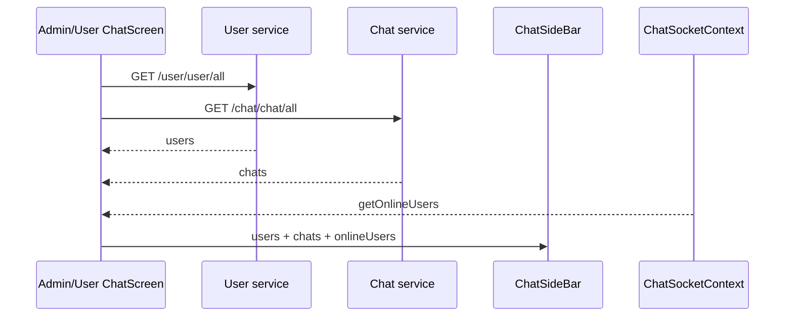

# Luồng Chat realtime của Nrapp

> Tài liệu này mô tả source Chat hiện tại. Tổng quan toàn dự án nằm tại
> [Kiến trúc và luồng hoạt động](kien-truc-va-luong-hoat-dong.md).

## 1. Nguyên tắc thiết kế

Chat dùng hai kênh song song:

- REST tạo/lấy dữ liệu bền vững: user, chat, message và ảnh.
- Socket.IO báo thay đổi tức thời: online, tin mới, typing và đã xem.

Admin và user dùng chung hợp đồng dữ liệu, service và socket context, nhưng có
source giao diện riêng hoàn toàn:

```text
src/features/chat/
├── admin/
│   ├── screens/AdminChatScreen.tsx
│   └── ui/
│       ├── AdminChatHeader.tsx
│       ├── AdminChatMessages.tsx
│       ├── AdminChatSideBar.tsx
│       └── AdminMessageInput.tsx
├── user/
│   ├── screens/UserChatScreen.tsx
│   └── ui/
│       ├── UserChatHeader.tsx
│       ├── UserChatMessages.tsx
│       ├── UserChatSideBar.tsx
│       └── UserMessageInput.tsx
└── shared/model/ChatSocketContext.tsx
```

Hai controller screen hiện chứa cùng quy tắc điều phối để mỗi khu tự sở hữu UI.
Khi sửa lỗi fetch, merge, typing hoặc socket listener, phải đối chiếu cả
`AdminChatScreen.tsx` và `UserChatScreen.tsx`.

## 2. Điểm vào và provider

```text
/admin/chat
  → app/(main)/admin/chat.tsx
  → AdminChatScreen

/user/chat
  → app/(main)/user/chat.tsx
  → UserChatScreen
```

`ChatSocketProvider` được gắn một lần trong `app/_layout.tsx`, bên trong
`AuthSessionProvider`:

```text
AuthSessionProvider
  └── ChatSocketProvider
      └── toàn bộ route của ứng dụng
```

Provider chỉ tạo socket khi đã có `user._id`. Nó cung cấp:

| State | Tác dụng |
| --- | --- |
| `socket` | Socket instance để screen đăng ký event hoặc emit |
| `onlineUsers` | Danh sách user ID đang online |
| `isConnected` | Trạng thái realtime hiện tại |
| `connectionError` | Lỗi kết nối gần nhất |

## 3. Kết nối Socket.IO

Nguồn cấu hình: `src/utils/ip.ts`.

```text
socketUrl = EXPO_PUBLIC_SOCKET_URL
         hoặc origin của EXPO_PUBLIC_API_URL/ipNR

socketPath = EXPO_PUBLIC_SOCKET_PATH
           hoặc /socket.io
```

Socket cấu hình transport theo thứ tự `websocket`, sau đó `polling`. Trường
`auth` là callback gọi `getToken()` nên mỗi lần reconnect đều lấy access token
mới nhất.

Vòng đời:

1. Có user → tạo socket, đăng ký listener nền và gọi `connect()`.
2. `connect` → `isConnected=true`, xóa lỗi.
3. `disconnect`/`connect_error` → cập nhật trạng thái cho UI.
4. `getOnlineUsers` → chuẩn hóa mọi ID thành chuỗi.
5. User đổi sau refresh phiên → hủy socket cũ và tạo socket mới.
6. Logout/unmount → disconnect, remove listener và reset state.

REST vẫn có thể tải và gửi dữ liệu khi realtime mất kết nối; lúc đó badge
online, typing và thông báo tức thời có thể chậm cho đến khi danh sách được tải
lại.

## 4. REST API

File: `src/services/chat/chat.service.ts`.

| Method | Endpoint | Hàm | Tác dụng |
| --- | --- | --- | --- |
| POST | `/chat/chat/new` | `createChat` | Tạo/lấy cuộc chat với một user |
| GET | `/chat/chat/all` | `getChats` | Danh sách chat, tin gần nhất, số chưa xem |
| GET | `/chat/message/:chatId` | `getChatMessages` | Tin nhắn và người đối thoại |
| POST | `/chat/message` | `sendChatMessage` | Gửi text hoặc multipart ảnh |

Bốn endpoint đều nhận Bearer token. Screen lấy token từ `AuthSessionContext`
rồi truyền rõ ràng vào service; Axios không tự gắn token cho request mới.

## 5. Mở màn Chat

Khi route được focus:



Screen chuẩn hóa response trước khi render:

- User đi qua `normalizeUser` để ổn định `_id`, `name`, `email`, `role`.
- Chat được đưa về `ChatSummary` thống nhất dù backend bọc `user/chat` khác nhau.
- `unseenCount`, `latestMessage` và thời gian được giữ cho sidebar.
- Sequence của request danh sách ngăn response cũ ghi đè response mới hơn.

## 6. Chọn hoặc tạo cuộc chat

Nếu user đã có chat, sidebar truyền `chatId` vào `selectChat`. Nếu chưa có:

```text
chọn user
  → POST /chat/chat/new { otherUserId }
  → nhận chatId
  → selectChat(chatId)
  → GET /chat/message/:chatId
  → render header + messages + input
```

Mỗi lần đổi chat, screen:

- cập nhật `selectedChatRef`;
- tăng phiên bản lựa chọn;
- xóa messages, chat user, draft text và typing cũ;
- bỏ response tải message nếu chat đã đổi trong lúc request đang chạy.

Message được chuẩn hóa rồi merge theo `_id`. Message sai `chatId` bị bỏ, bản
trùng được hợp nhất và toàn bộ danh sách được sắp theo `createdAt`, sau đó theo
ID để có thứ tự ổn định.

## 7. Gửi text

```text
nhập nội dung
  → kiểm tra text sau trim
  → dừng typing
  → POST /chat/message { chatId, text }
  → merge data.message vào chat đang mở
  → xóa đúng draft vừa gửi
  → GET /chat/chat/all để cập nhật sidebar
```

Draft chỉ bị xóa nếu người dùng chưa thay nội dung trong lúc request gửi đang
chạy. Input dùng `sendingRef` và state `sending` để chặn bấm gửi trùng.

## 8. Gửi ảnh

Input admin và user có UI riêng nhưng cùng quy trình:

1. Xin quyền truy cập thư viện.
2. Chỉ chọn một ảnh, quality `0.8`.
3. Chặn file có `fileSize > 5 MB`.
4. Chỉ chấp nhận JPEG, PNG hoặc GIF; `image/jpg` được chuẩn hóa thành JPEG.
5. Hiện preview, cho bỏ ảnh trước khi gửi.
6. Preflight `GET <API origin>/health` tối đa ba lần:
   - timeout mỗi lần: 4 giây;
   - chờ giữa hai lần: 400 ms.
7. Dựng multipart `FormData`:
   - Web: đổi URI sang Blob.
   - Native: thêm `{ uri, name, type }`.
8. `POST /chat/message` với timeout upload 60 giây.
9. Thành công mới xóa preview và merge message trả về.

Các field multipart:

```text
chatId: bắt buộc
text: tùy chọn
image: bắt buộc khi gửi ảnh
```

Service phân biệt lỗi định dạng, Gateway chưa kết nối, upload timeout, lỗi
backend và lỗi mạng để trả thông báo phù hợp.

## 9. Event realtime

| Event | Hướng tại frontend | Payload frontend dùng | Xử lý |
| --- | --- | --- | --- |
| `getOnlineUsers` | nhận ở Context | `string[]` | Cập nhật badge online |
| `newMessage` | nhận ở Screen | `{ message }` | Merge chat đang mở hoặc refresh sidebar |
| `typing` | phát từ Screen | `{ chatId, targetUserId }` | Báo đang nhập |
| `typingStop` | phát từ Screen | `{ chatId, targetUserId }` | Dừng đang nhập |
| `userTyping` | nhận ở Screen | `{ chatId, userId }` | Chỉ bật nếu đúng chat và đối phương |
| `userTypingStop` | nhận ở Screen | `{ chatId }` | Tắt typing của chat đang mở |
| `messagesSeen` | nhận ở Screen | `{ chatId }` | Đánh dấu tin mình gửi là đã xem |

Typing hoạt động như sau:

```text
input có nội dung
  → emit typing
  → reset timer
  → không gõ thêm trong 800 ms: emit typingStop
```

Xóa hết text, đóng chat hoặc gửi message cũng emit `typingStop`. Khi realtime
mất kết nối, UI xóa trạng thái `isTyping` để không treo nhãn “đang nhập”.

Khi nhận `newMessage`:

- Đúng chat đang mở: merge ngay, sau đó tải lại chat để đồng bộ seen/user.
- Chat khác: chỉ tải lại sidebar để cập nhật tin mới và `unseenCount`.

Khi nhận `messagesSeen`, screen chỉ cập nhật message do tài khoản hiện tại gửi
trong đúng chat đang mở.

## 10. Bàn phím và quay lại

- iOS dùng `KeyboardAvoidingView` với behavior `padding`.
- Android đo phần bàn phím che vùng chat và cộng `paddingBottom` tương ứng.
- Khi đang mở một cuộc chat, nút Back Android đóng chat và quay về sidebar thay
  vì thoát route ngay.
- Main bottom bar được layout cấp trên ẩn khi bàn phím mở.

## 11. Khi cần sửa lỗi

| Hiện tượng | Nơi kiểm tra trước |
| --- | --- |
| Không tải user/chat | `getAllUsers`, `getChats`, token và Gateway URL |
| Đổi chat nhanh bị hiện sai tin | selection version, request sequence, `selectedChatRef` |
| Tin bị trùng/sai thứ tự | `normalizeMessage`, `mergeMessages` ở cả hai Screen |
| Gửi text được nhưng ảnh lỗi | `/health`, MIME, FormData, giới hạn 5 MB, timeout 60 giây |
| Không hiện online | `ChatSocketContext`, socket URL/path, event `getOnlineUsers` |
| Không hiện tin mới | listener `newMessage` ở cả hai Screen |
| Typing bị treo | timer 800 ms, `typingStop`, cleanup khi đóng chat |
| Seen không đổi | payload `messagesSeen`, sender ID và chat ID |
| Input bị bàn phím che | logic keyboard riêng iOS/Android trong ChatScreen |

## 12. Checklist khi thay đổi Chat

1. Giữ UI admin trong `chat/admin`, UI user trong `chat/user`.
2. Nếu sửa controller data flow, áp dụng và kiểm tra cả hai ChatScreen.
3. Không đăng ký socket listener mà thiếu `off` trong cleanup.
4. Luôn kiểm tra `chatId` trước khi merge event hoặc response.
5. Không bỏ sequence/ref chống race condition khi đổi chat nhanh.
6. Kiểm tra riêng text, ảnh, typing, seen, reconnect và Android keyboard.
7. Chạy `npm run lint`, `npx tsc --noEmit` và Expo web export.
