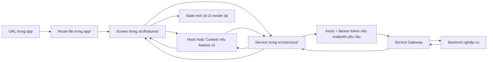
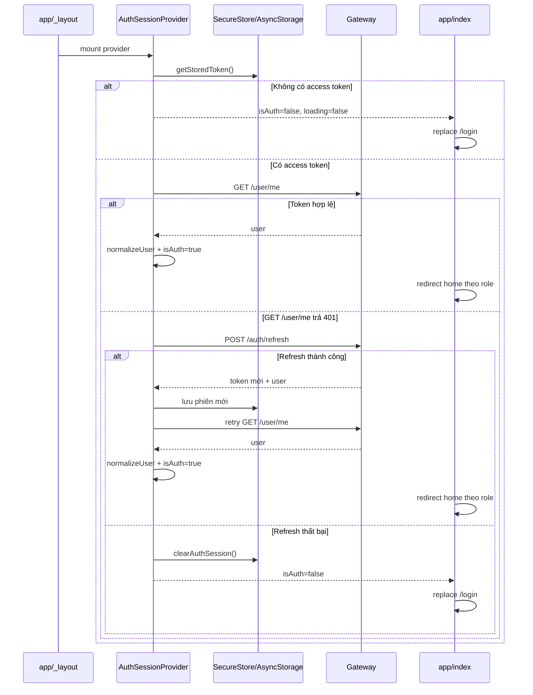
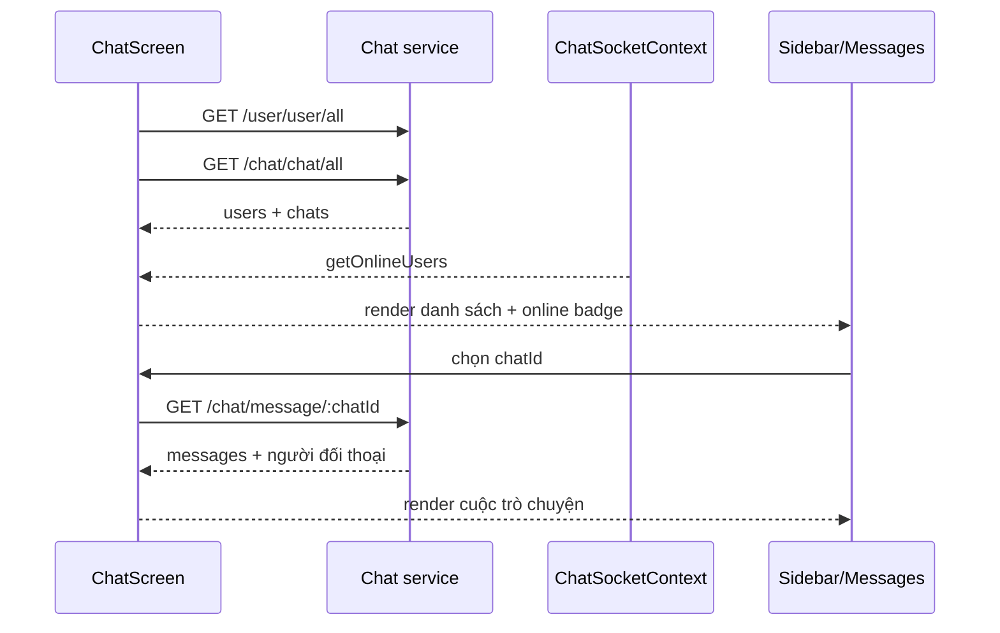
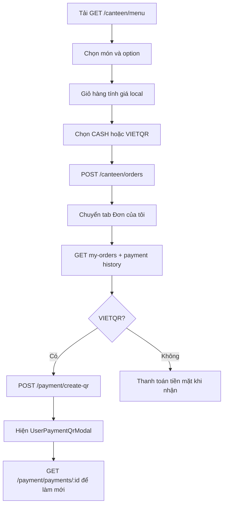
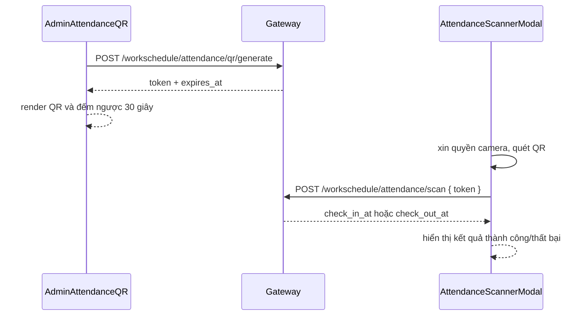

# Kiến trúc và luồng hoạt động của Nrapp

> Tài liệu nguồn chuẩn dành cho người mới đọc dự án. Nội dung được đối chiếu
> trực tiếp với source frontend ngày 27/08/2026.

## 1. Mục đích và cách đọc tài liệu

Tài liệu này trả lời sáu câu hỏi thường gặp khi bắt đầu làm việc với Nrapp:

1. Một URL trong ứng dụng đi vào file nào?
2. Admin và user được phân luồng ở đâu?
3. State nằm trong screen, hook hay context nào?
4. API nào được gọi và file service nào chịu trách nhiệm?
5. Sau khi backend trả dữ liệu, UI được cập nhật như thế nào?
6. Muốn sửa hoặc thêm chức năng thì nên bắt đầu từ thư mục nào?

Nên đọc theo thứ tự:

1. Đọc phần 2 để nắm mô hình tổng quát.
2. Đọc phần 4 và 5 để hiểu đăng nhập, route và quyền.
3. Chọn tính năng cần làm tại phần 7.
4. Tra endpoint tương ứng tại phần 9.
5. Dùng phần 11 khi cần sửa hoặc mở rộng code.

### 1.1 Từ điển tên gọi

| Tên | Ý nghĩa trong dự án |
| --- | --- |
| Route | File trong `app/`; tạo URL và nối URL với screen |
| Screen | Màn hình hoàn chỉnh của một tính năng |
| UI component | Khối giao diện nhỏ được screen ghép lại |
| Hook | Gom thao tác/state có thể tái sử dụng, thường bọc service |
| Context/model | State sống lâu hoặc được nhiều component trong một vùng sử dụng |
| Service | Hàm HTTP gọi Gateway; không chứa bố cục giao diện |
| Constant/type | Kiểu dữ liệu, trạng thái và metadata cố định |
| `admin/` | Source chỉ dành cho giao diện/vận hành khu quản trị |
| `user/` | Source chỉ dành cho giao diện người dùng/nhân viên |
| `shared/` | Logic hoặc hạ tầng thật sự trung lập về vai trò |

## 2. Mô hình kiến trúc tổng quát

### 2.1 Luồng từ thao tác người dùng đến Gateway



Toàn bộ REST API được ghép từ `ipNR` và đi qua Gateway. Chat Socket.IO mặc định
dùng origin của Gateway, nhưng có thể trỏ sang host riêng qua
`EXPO_PUBLIC_SOCKET_URL`. Nrapp không gọi thẳng từng microservice nội bộ.

### 2.2 Quy tắc phụ thuộc

```text
app route
  └── feature screen
        ├── feature ui
        ├── feature hook/context
        ├── shared utility thuần
        └── service
              ├── constant/type
              └── utils axios/ip/apiHelper
```

Các hướng phụ thuộc không được phép:

- `admin/` import UI hoặc screen từ `user/`.
- `user/` import UI hoặc screen từ `admin/`.
- `admin/` hoặc `user/` import `shared/screens/**` hay `shared/ui/**` của cùng
  feature; giao diện theo vai trò phải có source riêng.
- `shared/` phụ thuộc ngược vào `admin/` hoặc `user/`.
- Route chứa nghiệp vụ lớn hoặc tự viết URL API.
- UI component tự lưu token hoặc tự dựng base URL Gateway.

`eslint.config.js` đang chặn các nhóm import chéo trên. Nhờ vậy hai giao diện
admin/user có thể phát triển độc lập mà vẫn dùng chung type, hook hoặc utility
trung lập.

`AttendanceScannerModal` là ngoại lệ có chủ đích: root main layout import modal
chấm công trung lập này, không phải screen admin/user dùng chung một giao diện.
Ba route auth (`login`, `register`, `verify`) hiện còn giữ form state,
validation và gọi service trực tiếp; đây là cấu trúc hiện hữu trước quy ước
route mỏng, không phải mẫu nên sao chép cho feature mới.

### 2.3 State được đặt ở đâu?

| Loại state | Vị trí hiện tại | Ví dụ |
| --- | --- | --- |
| Toàn ứng dụng | Context ở root | phiên đăng nhập, socket chat |
| Trong một dashboard lớn | Feature context | dữ liệu quản trị lịch làm |
| Nghiệp vụ tái sử dụng | Hook | lịch cá nhân, đơn từ nhân sự |
| Chỉ dùng tại một màn | Screen state | bộ lọc, tab, giỏ hàng, form |
| Chỉ dùng tại component | UI state | mở form sửa, chọn ảnh, cuộn danh sách |

## 3. Bản đồ thư mục

```text
Nrapp/
├── app/                  # Expo Router: URL, layout, route guard
├── assets/               # Ảnh và icon đóng gói cùng ứng dụng
├── docs/                 # Tài liệu kỹ thuật
├── scripts/              # Script hỗ trợ chạy/reset dự án
├── src/
│   ├── application/      # Quy tắc toàn app: role, quyền, route constants
│   ├── components/       # Component khung dùng nhiều tính năng
│   ├── features/         # Screen, UI, hook, context theo nghiệp vụ
│   ├── services/         # REST API và type dữ liệu theo domain
│   ├── shared/           # UI/model/hook nền tảng dùng chung
│   └── utils/            # Axios, địa chỉ Gateway, xử lý lỗi HTTP
├── app.json              # Cấu hình Expo và nền tảng
├── package.json          # Dependency và npm scripts
├── eslint.config.js      # Lint và ranh giới import theo vai trò
├── tailwind.config.js    # NativeWind/Tailwind content scan
├── metro.config.js       # Metro + NativeWind
├── babel.config.js       # Babel Expo/Reanimated
├── tsconfig.json         # TypeScript strict và alias @/
└── global.css            # Tailwind directives
```

### 3.1 Thư mục không phải source

| Thư mục | Tác dụng | Có sửa tay không? |
| --- | --- | --- |
| `node_modules/` | Package do npm cài | Không |
| `.expo/` | Cache và metadata local của Expo | Không |
| `dist/` | Kết quả `expo export` | Không; có thể tạo lại |

### 3.2 Bản đồ `src/services`

| File/thư mục | Hợp đồng Gateway phụ trách |
| --- | --- |
| `services/auth/auth.service.ts` | Đăng ký, login, OTP, refresh, token, email và xóa/phân quyền tài khoản |
| `services/auth/constant.ts` | Payload auth, response phiên và storage key |
| `services/user/user.service.ts` | Profile hiện tại, danh sách user và đổi tên hiển thị |
| `services/user/constant.ts` | `User`, role biết trước và chuẩn hóa role |
| `services/chat/chat.service.ts` | Tạo chat, danh sách chat, message và upload ảnh |
| `services/chat/constant.ts` | Chat/message/image types và MIME helper |
| `services/todo/todo.service.ts` | CRUD, giao và đổi trạng thái task |
| `services/todo/constant.ts` | Task type, filter, pagination, transition và metadata UI |
| `services/workschedule/workschedule.service.ts` | Lịch tuần, policy, đơn nhân sự, QR, attendance và báo cáo |
| `services/workschedule/constant.ts` | Toàn bộ type/payload/response của workschedule |
| `services/canteen/canteen.service.ts` | Menu, order và hàng đợi bếp |
| `services/canteen/category.service.ts` | CRUD danh mục món |
| `services/canteen/inventory.service.ts` | Nguyên liệu, lô, cảnh báo hạn và tiêu hao |
| `services/canteen/table.service.ts` | Bàn, trạng thái và phân bàn |
| `services/canteen/analytics.service.ts` | Top món căn tin |
| `services/canteen/admin-resource.ts` | Chuẩn hóa list/pagination của resource admin |
| `services/canteen/constant.ts` | Menu, order, trạng thái và query types |
| `services/payment/payment.service.ts` | Tạo/kiểm tra VietQR và lịch sử thanh toán |
| `services/payment/constant.ts` | Payment record và trạng thái giao dịch |

## 4. Vòng đời ứng dụng, đăng nhập và refresh token

### 4.1 Entry và root layout

Entry thật được khai báo trong `package.json`:

```text
"main": "expo-router/entry"
  → Expo Router đọc app/
  → app/_layout.tsx
  → app/index.tsx
```

`app/_layout.tsx` import `global.css`, cấu hình logger Reanimated, rồi khai báo
Root Stack gồm `index`, `(auth)` và `(main)`; cả ba đều tắt header mặc định.
Scheme deep link trong `app.json` là `nrapp`.

### 4.2 Thứ tự provider khi mở app

`app/_layout.tsx` là gốc của toàn bộ cây React:

```text
SafeAreaProvider
  └── AuthSessionProvider
      └── ChatSocketProvider
          └── ThemeProvider
              ├── Stack: index, (auth), (main)
              ├── AppAlertHost
              └── StatusBar
```

Ý nghĩa:

- Mọi screen đều đọc được phiên đăng nhập.
- Socket chỉ kết nối sau khi Auth Context có `user._id`.
- `AppAlert.alert(...)` ở bất kỳ feature nào đều được `AppAlertHost` hiển thị.
- Safe area được cung cấp một lần cho toàn ứng dụng.

### 4.3 Khôi phục phiên khi mở lại ứng dụng



Nơi thực hiện:

- `src/features/auth/model/AuthSessionContext.tsx`: nguồn sự thật của phiên.
- `src/services/auth/auth.service.ts`: lưu, đọc, refresh và xóa token.
- `src/shared/model/normalize-user.ts`: chuẩn hóa user backend trả về.
- `app/index.tsx`: redirect ban đầu.

Web lưu token bằng AsyncStorage. Mobile ưu tiên SecureStore và tự di chuyển
token cũ từ AsyncStorage nếu có.

Nếu `/user/me` lỗi `401`, interceptor sẽ thử refresh phiên trước. Lỗi
`401/403/404` không khôi phục được sẽ xóa token; lỗi mạng khác vẫn đưa UI về
trạng thái chưa đăng nhập nhưng giữ token để lần mở app sau có thể thử lại.

### 4.4 Đăng ký

```text
/(auth)/register
  → kiểm tra tên, email, mật khẩu, xác nhận mật khẩu
  → POST /auth/register
  → thành công: replace /login và truyền lại email
```

File chính:

- `app/(auth)/register.tsx`: state form và điều hướng.
- `src/features/auth/ui/AuthForm.tsx`: input, nút và khung auth dùng chung.
- `src/services/auth/auth.service.ts`: `registerUser`.

### 4.5 Đăng nhập OTP

```text
/(auth)/login
  → POST /auth/login { email, password }
  → Gateway yêu cầu/gửi OTP
  → push /(auth)/verify?email=...
  → nhập đủ 6 số
  → POST /auth/verify { email, otp }
  → saveAuthSession(data) với data.token + data.refreshToken
  → normalizeUser
  → setUser + setIsAuth(true)
  → effect redirect đến home đúng role
```

Lưu ý: `loginUser` chưa tạo phiên ở frontend; phiên chỉ được lưu sau khi OTP
được xác minh thành công.

### 4.6 Tự refresh khi API trả 401

`AuthSessionProvider` đăng ký Axios response interceptor:

1. Request trả 401.
2. Nếu request chưa retry, đọc refresh token.
3. Nhiều request cùng lỗi dùng chung `refreshPromiseRef`, tránh refresh lặp.
4. `POST /auth/refresh` bằng Axios gốc để không tự lọt lại interceptor.
5. Lưu session mới, `normalizeUser`, đặt `user/isAuth` trong context.
6. Thay header `Authorization`, gọi lại request cũ.
7. Nếu refresh thất bại hoặc request retry vẫn 401: xóa phiên và logout UI.

### 4.7 Đăng xuất và xóa tài khoản

- `logoutUser` chỉ gọi `clearAuthSession` và xóa `user/isAuth`; chính Profile
  gọi `router.replace`, hoặc main layout thấy mất phiên rồi chuyển về login.
- Xóa tài khoản cá nhân: `DELETE /auth/me` → logout → về login.
- Hai giao diện profile admin/user riêng biệt nhưng cùng quy trình nghiệp vụ.

## 5. Phân quyền và điều hướng admin/user

### 5.1 Hai lớp kiểm tra phía frontend

1. `getAreaForRole` chọn `admin` hoặc `user`.
2. `AreaGuard` tại `app/(main)/admin/_layout.tsx` và
   `app/(main)/user/_layout.tsx` chặn URL sai khu vực.

Nếu tài khoản nhập URL sai khu, `AreaGuard` redirect về home đúng role. Đây là
bảo vệ trải nghiệm phía client; Gateway/backend vẫn phải kiểm tra quyền thật.

### 5.2 Ma trận quyền hiện tại

| Role | Khu UI | Quản lý tài khoản | Quản lý task | Quản lý lịch/chấm công |
| --- | --- | ---: | ---: | ---: |
| `admin` | admin | Có | Có | Có |
| `manager` | admin | Không | Có | Có |
| `chef` | admin | Không | Có | Có |
| `cashier` | admin | Không | Không; xem task cá nhân | Không; xem lịch cá nhân |
| `waiter` | admin | Không | Không; xem task cá nhân | Không; xem lịch cá nhân |
| `user` | user | Không | Task cá nhân | Lịch cá nhân |
| `vip` | user | Không | Task cá nhân | Lịch cá nhân |
| role chưa biết | user | Không | Task cá nhân | Lịch cá nhân |

Các hàm nguồn tại `src/application/access/roles.ts`:

- `isAdminRole`: quyết định khu UI.
- `canManageAccounts`: chỉ `admin`.
- `canManageTasks`: `admin`, `manager`, `chef`.
- `canManageWorkSchedule`: `admin`, `manager`, `chef`.
- `getRoleLabel`: nhãn tiếng Việt.

`normalizeAppRole` đưa role rỗng về `user`. `getAreaForRole` hiện chỉ kiểm tra
role có thuộc `ADMIN_ROLES` hay không, nên mọi role lạ cũng vào khu user;
`USER_AREA_ROLES = ["user", "vip"]` đang được khai báo nhưng chưa tham gia phép
chọn area.

Lưu ý về phạm vi guard hiện tại:

- `/admin/workschedule` tự kiểm tra `canManageWorkSchedule`; cashier/waiter được
  đưa sang `AdminPersonalWorkscheduleScreen`.
- Các route con `/admin/utilities/calendar`, `overview` và `requests` mới chỉ
  qua `AreaGuard`. Màn tiện ích cũng đang hiện card cho mọi admin-area role.
  Vì vậy cashier/waiter vẫn có thể mở các màn quản trị này và phải dựa vào
  backend từ chối API không đủ quyền. Đây là điểm frontend còn nên bổ sung
  guard chi tiết; không được xem việc ẩn nút là lớp bảo mật.

### 5.3 Route constants

`src/application/navigation/routes.ts` là nơi dùng khi điều hướng từ code.
`createAreaRoutes(area)` tạo cùng bộ key cho hai khu:

```text
home, chat, todo, canteen, workschedule, utilities, directory, profile
```

Không nên rải chuỗi `/(main)/...` ở nhiều component nếu route đó được dùng lặp.
Các route con `utilities/calendar`, `utilities/overview`, `utilities/requests`
và `utilities/requests/create` hiện vẫn được viết trực tiếp dưới dạng `Href`
trong screen, chưa có key trong `routes.ts`.

### 5.4 Bảng route đầy đủ

| URL hiển thị | Route file | Screen |
| --- | --- | --- |
| `/` | `app/index.tsx` | Kiểm tra phiên và redirect |
| `/login` | `app/(auth)/login.tsx` | Đăng nhập |
| `/register` | `app/(auth)/register.tsx` | Đăng ký |
| `/verify?email=...` | `app/(auth)/verify.tsx` | Xác minh OTP; thiếu email sẽ về login |
| `/admin/home` | `app/(main)/admin/home.tsx` | `AdminHomeScreen` |
| `/admin/chat` | `app/(main)/admin/chat.tsx` | `AdminChatScreen` |
| `/admin/todo` | `app/(main)/admin/todo.tsx` | `AdminTodoScreen` |
| `/admin/canteen` | `app/(main)/admin/canteen.tsx` | `AdminCanteenScreen` |
| `/admin/directory` | `app/(main)/admin/directory.tsx` | `AdminDirectoryScreen` |
| `/admin/profile` | `app/(main)/admin/profile.tsx` | `AdminProfileScreen` |
| `/admin/workschedule` | `app/(main)/admin/workschedule.tsx` | `AdminWorkscheduleScreen` |
| `/admin/utilities` | `app/(main)/admin/utilities/index.tsx` | Trung tâm tiện ích admin |
| `/admin/utilities/calendar` | `app/(main)/admin/utilities/calendar.tsx` | Lịch toàn hệ thống |
| `/admin/utilities/overview` | `app/(main)/admin/utilities/overview.tsx` | Báo cáo vận hành |
| `/admin/utilities/requests` | `app/(main)/admin/utilities/requests/index.tsx` | Duyệt đơn nhân sự |
| `/admin/utilities/requests/create` | `app/(main)/admin/utilities/requests/create.tsx` | Tạo đơn cá nhân của tài khoản admin-area |
| `/user/home` | `app/(main)/user/home.tsx` | `UserHomeScreen` |
| `/user/chat` | `app/(main)/user/chat.tsx` | `UserChatScreen` |
| `/user/todo` | `app/(main)/user/todo.tsx` | `UserTodoScreen` |
| `/user/canteen` | `app/(main)/user/canteen.tsx` | `UserCanteenScreen` |
| `/user/directory` | `app/(main)/user/directory.tsx` | `UserDirectoryScreen` |
| `/user/profile` | `app/(main)/user/profile.tsx` | `UserProfileScreen` |
| `/user/workschedule` | `app/(main)/user/workschedule/index.tsx` | Đăng ký lịch tuần |
| `/user/utilities` | `app/(main)/user/utilities/index.tsx` | Tiện ích nhân sự |
| `/user/utilities/calendar` | `app/(main)/user/utilities/calendar.tsx` | Lịch và chấm công cá nhân |
| `/user/utilities/overview` | `app/(main)/user/utilities/overview.tsx` | Thống kê cá nhân theo tháng |
| `/user/utilities/requests` | `app/(main)/user/utilities/requests/index.tsx` | Tạo/xem đơn từ |
| `/user/utilities/requests/create` | `app/(main)/user/utilities/requests/create.tsx` | Form tạo đơn |

Route group `(auth)` và `(main)` chỉ dùng tổ chức layout, không xuất hiện trong
URL người dùng nhìn thấy.

Các layout con:

- `app/(auth)/_layout.tsx`: Stack login/register/verify, tắt header mặc định.
- `app/(main)/admin/_layout.tsx`: `<AreaGuard area="admin" />`.
- `app/(main)/user/_layout.tsx`: `<AreaGuard area="user" />`.
- `AreaGuard` trả `<Slot />` khi phiên và area hợp lệ.

`router.push` giữ màn hiện tại trong stack để có thể quay lại;
`router.replace` thay màn hiện tại nên được dùng cho login, logout và redirect.

### 5.5 Khung sau đăng nhập

`app/(main)/_layout.tsx`:

- Redirect về login nếu phiên biến mất.
- Render stack admin/user.
- Thêm khoảng safe-area phía trên cho màn không phải home/profile.
- Ẩn bottom bar khi bàn phím mở.
- Gắn `MainBottomBar` gồm Trang chủ, nút quét QR và Hồ sơ.
- Gắn một `AttendanceScannerModal` dùng chung cho mọi tài khoản đã đăng nhập.

## 6. Quy ước cấu trúc một feature

Ví dụ feature có đầy đủ nhánh:

```text
src/features/workschedule/
├── admin/
│   ├── screens/          # Màn admin hoàn chỉnh
│   ├── ui/               # Component chỉ admin dùng
│   ├── hooks/            # Hook nghiệp vụ admin
│   └── model/            # Context/state dashboard admin
├── user/
│   ├── screens/          # Màn user hoàn chỉnh
│   └── ui/               # Component chỉ user dùng
└── shared/
    ├── config/           # Metadata thuần
    ├── hooks/            # Nghiệp vụ cá nhân trung lập vai trò
    ├── ui/               # Hạ tầng UI thật sự dùng ngoài hai nhánh
    └── utils/            # Hàm ngày/định dạng thuần
```

Quy tắc chọn vị trí:

- Thay đổi bố cục admin: sửa `admin/screens` hoặc `admin/ui`.
- Thay đổi bố cục user: sửa `user/screens` hoặc `user/ui`.
- Cả hai cần cùng quy tắc tính toán: đưa hàm thuần/hook vào `shared`.
- Cả hai chỉ cùng endpoint/type: dùng `src/services`, không cần dùng chung UI.

## 7. Luồng hoạt động từng tính năng

### 7.1 Auth

| Vị trí | Trách nhiệm |
| --- | --- |
| `app/(auth)/login.tsx` | Form login, gọi bước gửi OTP, điều hướng verify |
| `app/(auth)/register.tsx` | Form tạo tài khoản |
| `app/(auth)/verify.tsx` | Sáu ô OTP, lưu phiên và cập nhật Auth Context |
| `src/features/auth/ui/AuthForm.tsx` | Khung, input và nút auth dùng lại |
| `src/features/auth/model/AuthSessionContext.tsx` | State phiên, bootstrap, refresh interceptor, logout |
| `src/services/auth/auth.service.ts` | Endpoint auth và lưu token |
| `src/services/auth/constant.ts` | Payload/response và storage key |

State form ở từng route vì chỉ route đó cần. State phiên ở context vì mọi
feature đều cần user/token.

### 7.2 Trang chủ

#### Admin

`src/features/home/admin/screens/AdminHomeScreen.tsx`:

1. Đọc user và quyền từ Auth Context.
2. Nếu có quyền lịch, tải song song lịch chờ duyệt và chấm công hôm nay.
3. Tạo danh sách công cụ bằng `useMemo`; mô tả thay đổi theo quyền task/account.
4. Điều hướng đến lịch, todo, căn tin, danh bạ, chat hoặc profile.
5. Pull-to-refresh chạy lại dữ liệu tổng quan.

Cashier/waiter vẫn ở giao diện admin nhưng không gọi dashboard quản lý lịch.

#### User

`src/features/home/user/screens/UserHomeScreen.tsx`:

1. `useFocusEffect` gọi `usePersonalWorkschedule().getMySchedules()`.
2. Tìm request có `week_start` trùng thứ Hai của tuần hiện tại.
3. Tách entry hôm nay và ngày mai.
4. Render loại lịch `office`, `remote`, `day_off`, `leave`.
5. Nếu chưa có lịch, dẫn đến `/user/workschedule` để đăng ký.

Khối “Tin tức” hiện là ba bài viết hard-code ngay trong frontend. Bấm một bài
chỉ mở `AppAlert`; chưa có service, API hoặc màn chi tiết tin tức.

### 7.3 Danh bạ

#### UserDirectoryScreen

Vị trí: `src/features/directory/user/screens/UserDirectoryScreen.tsx`.

```text
Mở/focus màn
  → getToken
  → GET /user/user/all
  → normalizeUser từng bản ghi
  → lưu users
  → lọc local theo tên/email
  → FlatList chỉ xem
```

State chính: `users`, `query`, `loading`, `refreshing`, `errorMessage`.

#### AdminDirectoryScreen

Vị trí: `src/features/directory/admin/screens/AdminDirectoryScreen.tsx`.

- Mọi role admin-area có thể tải danh bạ.
- Chỉ role `admin` (`canManageAccounts`) thấy email/role và thao tác tài khoản.
- Đổi role: chọn `ROLE_OPTIONS` → xác nhận → PATCH role → cập nhật item local.
- Xóa user: xác nhận destructive → DELETE user → loại item khỏi state local.
- Không cho tài khoản admin tự sửa role hoặc tự xóa chính mình ở màn danh bạ.

### 7.4 Hồ sơ cá nhân

Vị trí:

- `src/features/profile/admin/screens/AdminProfileScreen.tsx`.
- `src/features/profile/user/screens/UserProfileScreen.tsx`.

Hai file có giao diện độc lập. Luồng nghiệp vụ giống nhau:

```text
Mở editor
  → copy user.name/email sang draft
  → kiểm tra tên và định dạng email
  → nếu tên đổi: POST /user/update/user
  → nếu email đổi: PATCH /auth/me/email
  → cập nhật user trong AuthSessionContext
  → đóng editor
```

Ngoài ra screen còn có đăng xuất và xóa tài khoản cá nhân. Vì cập nhật tên và
email là hai request tuần tự, có thể xảy ra trường hợp tên đã lưu nhưng request
email lỗi; context vẫn giữ phần đã cập nhật thành công.

### 7.5 Chat

#### Bản đồ file

| Vị trí | Trách nhiệm |
| --- | --- |
| `chat/admin/screens/AdminChatScreen.tsx` | Controller chat admin, theme tối/đỏ |
| `chat/admin/ui/*` | Sidebar, header, messages, input riêng của admin |
| `chat/user/screens/UserChatScreen.tsx` | Controller chat user, theme sáng/xanh |
| `chat/user/ui/*` | Sidebar, header, messages, input riêng của user |
| `chat/shared/model/ChatSocketContext.tsx` | Một kết nối Socket.IO toàn app |
| `services/chat/chat.service.ts` | REST chat và upload ảnh |
| `services/chat/constant.ts` | `ChatSummary`, `Message`, image MIME types |

Admin và user không dùng chung source UI. Hai controller có cùng quy tắc dữ
liệu để backend chat hoạt động đồng nhất.

#### Luồng mở chat



Screen dùng sequence/ref để bỏ response cũ nếu người dùng đổi chat rất nhanh.
`mergeMessages` loại message trùng ID và sắp xếp dữ liệu ổn định.
Biến `selectedUser` trong hai controller đang giữ **chat ID**, không phải user
ID; ID người đối thoại được suy ra riêng từ `chatUser`.

#### Tạo và gửi chat

- Tạo chat: chọn đồng nghiệp → `POST /chat/chat/new { otherUserId }` → nhận
  `chatId` → mở chat → refresh sidebar.
- Gửi text: `POST /chat/message { chatId, text }` → merge response vào local →
  refresh danh sách chat.
- Gửi ảnh: giới hạn 5 MB, kiểm tra JPG/PNG/GIF → gọi `/health` tối đa ba lần →
  dựng FormData khác nhau cho web/mobile → upload timeout 60 giây.

#### Realtime event

| Event | Nơi nhận/phát | Tác dụng |
| --- | --- | --- |
| `getOnlineUsers` | Socket Context nhận | Cập nhật danh sách ID online |
| `newMessage` | ChatScreen nhận | Merge vào chat đang mở hoặc refresh sidebar |
| `typing` | ChatScreen phát | Báo người đối thoại đang nhập |
| `typingStop` | ChatScreen phát | Dừng trạng thái typing sau 800 ms |
| `userTyping` | ChatScreen nhận | Hiện “đang nhập” đúng chat/user |
| `userTypingStop` | ChatScreen nhận | Tắt “đang nhập” đúng chat |
| `messagesSeen` | ChatScreen nhận | Đánh dấu message mình gửi đã xem |

Socket lấy access token mới trong callback `auth` mỗi lần reconnect. Khi user
object đổi sau refresh token, socket cũ được hủy và tạo lại.

Context còn theo dõi `connect`, `disconnect`, `connect_error` và cleanup mọi
listener khi thay socket. Nút Back phần cứng Android đóng cuộc chat về sidebar
trước; hai screen cũng có xử lý keyboard riêng cho iOS và phần che trên Android.
Controller admin/user gần như nhân đôi có chủ đích, nên sửa fetch, race guard,
typing, merge hoặc realtime phải rà cả hai file.

Chi tiết payload, vòng đời socket, upload ảnh và checklist debug nằm tại
[Luồng Chat realtime](chat-flow.md).

### 7.6 Todo/công việc

#### Dữ liệu chính

- `TaskStatus`: `todo`, `in_progress`, `done`, `cancelled`.
- `TaskPriority`: `low`, `medium`, `high`.
- `TaskPage`: danh sách và pagination.
- Nguồn type/label: `src/services/todo/constant.ts`.

#### UserTodoScreen

Vị trí: `src/features/todo/user/`.

1. Lấy task cá nhân bằng `GET /todo/my-tasks`.
2. Gửi filter status, priority, search, page và limit 10 lên server.
3. Dùng `requestRef` để response cũ không ghi đè bộ lọc mới.
4. Người nhận chỉ chuyển `todo → in_progress → done`.
5. Sau PATCH status, tải lại trang hiện tại.

UI riêng gồm `UserTodoIntroCard`, `UserTodoTaskFilters` và
`UserTodoTaskListCard`.

#### AdminTodoScreen

Vị trí: `src/features/todo/admin/`.

- Với `admin/manager/chef`: gọi danh sách quản lý, tải user, tạo task, giao
  người khác, sửa nội dung, đổi trạng thái và xóa.
- Với `cashier/waiter`: cùng route admin nhưng `canManageTasks=false`; screen
  gọi `getMyTasks` và ẩn form tạo.
- Không cho tự chọn chính mình làm người được giao tại form admin.
- Sau mọi mutation, screen reload danh sách để đồng bộ với backend.

UI admin gồm `AdminTodoCreateTaskCard`, `AdminTodoEditTaskForm`,
`AdminTodoIntroCard`, `AdminTodoTaskFilters` và `AdminTodoTaskListCard`. Bộ lọc
hai vai trò cũng là hai source riêng; thay đổi hành vi phải kiểm tra cả hai.

Quy tắc trạng thái phía UI quản lý rộng hơn:

```text
todo        → in_progress | cancelled
in_progress → todo | done | cancelled
done        → in_progress
cancelled   → todo
```

### 7.7 Căn tin

#### Bản đồ file

| Vị trí | Trách nhiệm |
| --- | --- |
| `canteen/user/screens/UserCanteenScreen.tsx` | Menu, search, giỏ, đơn cá nhân, VietQR |
| `canteen/user/ui/UserOrderSummaryCard.tsx` | Thẻ đơn hàng user |
| `canteen/user/ui/UserPaymentQrModal.tsx` | Modal QR và trạng thái thanh toán |
| `canteen/admin/screens/AdminCanteenScreen.tsx` | Điều phối tab vận hành theo role |
| `canteen/admin/ui/AdminMenuCatalog.tsx` | CRUD món, undo/redo menu |
| `canteen/admin/ui/AdminCategoryManager.tsx` | CRUD danh mục |
| `canteen/admin/ui/AdminInventoryManager.tsx` | Nguyên liệu, lô, hạn dùng, tiêu hao |
| `canteen/admin/ui/AdminTableManager.tsx` | Bàn, trạng thái và phân bàn |
| `canteen/admin/ui/AdminCanteenAnalytics.tsx` | Món bán chạy/doanh thu |
| `canteen/admin/ui/AdminOrderSummaryCard.tsx` | Thẻ đơn cho vận hành |
| `canteen/shared/model/presentation.ts` | Format tiền/ngày/ID, màu status, lỗi |

#### Luồng user đặt món



Chi tiết:

- Search menu debounce 350 ms và gọi `/canteen/menu/search?q=...`.
- Một dòng giỏ được định danh bằng `menuItemId + tập option`, nên cùng món với
  option khác là hai dòng riêng.
- Tổng tiền được tính lại từ giá món, giá option và số lượng.
- Tải đơn và lịch sử thanh toán bằng `Promise.allSettled`; lỗi payment history
  không làm mất danh sách đơn.
- User chỉ thấy nút hủy khi đơn còn `CREATED` và chưa `PAID`.

#### Luồng vận hành đơn và bếp

Luồng FE kỳ vọng:

```text
CREATED
  → confirmCanteenOrder
CONFIRMED
  ├── getNextKitchenOrder: nhận nguyên tử đơn ưu tiên và chuyển sang COOKING
  └── setKitchenOrderCooking: chọn thủ công một đơn và chuyển sang COOKING
COOKING
  → setKitchenOrderReady
READY
  → completeCanteenOrder
COMPLETED
```

Với VietQR, nút xác nhận chỉ mở khi `paymentStatus=PAID`. Hủy trong khu vận
hành chỉ cho đơn chưa thanh toán và đang `CREATED/CONFIRMED`.

#### Ma trận công cụ căn tin

| Role | Điều phối đơn | Bếp | Menu/danh mục | Bàn | Kho | Thống kê |
| --- | ---: | ---: | ---: | ---: | ---: | ---: |
| admin | Có | Có | Có | Có | Có | Có |
| manager | Có | Có | Có | Có | Có | Có |
| chef | Chỉ xem đơn | Có | Không | Không | Xem + tiêu hao | Không |
| cashier | Có | Không | Không | Không | Không | Không |
| waiter | Có | Không | Không | Trạng thái + phân bàn | Không | Không |

Đây là điều kiện hiển thị/thao tác trong frontend. Backend phải kiểm tra lại
role cho từng endpoint.

Trong tab Bàn, chỉ admin/manager được tạo, sửa hoặc xóa cấu trúc bàn; waiter
được đổi trạng thái và phân bàn. Trong tab Kho, chỉ admin/manager được CRUD
nguyên liệu và nhập lô; chef được xem cảnh báo và tiêu hao. Thống kê căn tin chỉ
cộng dữ liệu top món từ đơn chưa hủy, chưa phải báo cáo tài chính đã đối soát.

### 7.8 Lịch làm, đơn nhân sự và chấm công

Ba khái niệm khác nhau:

| Khái niệm | Dữ liệu | Ví dụ |
| --- | --- | --- |
| Lịch tuần | `IScheduleRequest` + `IScheduleEntry[]` | Office/remote theo từng ngày |
| Đơn nhân sự | `IWorkRequest` | Nghỉ, muộn, về sớm, OT, công tác, remote |
| Chấm công | `AdminAttendanceRecord` | Check-in/check-out QR hoặc tự động theo lịch |

#### Bản đồ file user/shared

| Vị trí | Trách nhiệm |
| --- | --- |
| `user/screens/UserWorkscheduleScreen.tsx` | Đăng ký lịch tuần |
| `user/ui/UserWeekPicker.tsx` | Chọn một trong các tuần được phép |
| `user/ui/UserDayScheduleEditor.tsx` | Chọn office/remote, ca và ghi chú |
| `user/screens/UserWorkscheduleUtilitiesScreen.tsx` | Menu tiện ích nhân sự |
| `user/screens/UserWorkCalendarScreen.tsx` | Lịch tháng + lịch sử chấm công |
| `user/screens/UserWorkRequestsScreen.tsx` | Loại đơn + lịch sử đơn |
| `user/screens/UserCreateWorkRequestScreen.tsx` | Form động theo loại đơn |
| `user/screens/UserMonthlyOverviewScreen.tsx` | Thống kê lịch/đơn theo tháng |
| `shared/hooks/usePersonalWorkschedule.ts` | API lịch/chấm công cá nhân |
| `shared/hooks/useWorkRequests.ts` | API đơn của chính tài khoản |
| `shared/config/workRequestConfig.ts` | Metadata sáu loại đơn |
| `shared/utils/date.ts` | Tuần, date key và kiểm tra policy |
| `shared/ui/AttendanceScannerModal.tsx` | Camera quét QR toàn app |

#### Luồng user đăng ký lịch tuần

1. Tải song song policy và toàn bộ lịch cá nhân khi screen được focus.
2. `getAllowedWeekRange` tạo năm tuần từ tuần hiện tại đến `+28 ngày`; mặc
   định chọn tuần kế tiếp.
3. Ghép entry backend với `editedEntries` local theo key `YYYY-MM-DD`.
4. Chỉ cho chọn `office` hoặc `remote`; ngày không chọn không được gửi.
5. Có preset T2–T6, hoặc sửa từng ngày và ca.
6. Không cho sửa ngày quá khứ, lịch pending/approved hoặc ngoài cửa đăng ký.
7. Chưa từng gửi: POST schedule request.
8. Bị từ chối: hiển thị lý do và POST resubmit sau khi sửa.
9. Thành công: xóa draft của tuần, tải lại dữ liệu.

Policy đóng khi `locked=true`, thời gian sai, chưa tới `registration_start` hoặc
đã quá `registration_end`.

Nếu tải policy lỗi, `usePersonalWorkschedule.getPolicy()` trả `null` và
`isRegistrationClosed(null)` hiện trả `false`; form vẫn mở để backend quyết
định khi submit. Đây là hành vi fail-open cần nhớ khi debug chính sách đăng ký.

#### Sáu loại đơn nhân sự

| Type | Nội dung riêng |
| --- | --- |
| `leave` | Ngày/buổi, tùy chọn nghỉ để đi học |
| `late` | Giờ đến muộn dự kiến |
| `early` | Giờ về sớm dự kiến |
| `overtime` | Khoảng thời gian và dự án |
| `business_trip` | Khoảng thời gian, địa điểm, chi phí dự kiến |
| `remote` | Ngày/buổi làm từ xa |

`UserCreateWorkRequestScreen` và `AdminCreateWorkRequestScreen` là hai giao
diện riêng nhưng đều tạo đơn của chính tài khoản đang đăng nhập qua
`useWorkRequests`. Chúng không phải màn admin tạo đơn thay nhân viên.
Route `/admin/utilities/requests/create` đã tồn tại nhưng hiện chưa có nút/link
từ `AdminWorkRequestsScreen` hoặc `AdminWorkscheduleUtilitiesScreen`; chỉ mở
được bằng điều hướng trực tiếp cho đến khi frontend nối điểm vào.

#### Bản đồ quản trị lịch

| Vị trí | Trách nhiệm |
| --- | --- |
| `admin/screens/AdminWorkscheduleScreen.tsx` | Chọn dashboard quản lý hoặc lịch cá nhân theo quyền |
| `admin/model/AdminWorkscheduleContext.tsx` | State tổng hợp dashboard quản lý |
| `admin/hooks/useWorkscheduleAdmin.ts` | Bọc toàn bộ service quản trị |
| `admin/ui/AdminRequestManager.tsx` | Duyệt/sửa/xóa lịch tuần |
| `admin/ui/AdminWorkRequestManager.tsx` | Duyệt/từ chối đơn nhân sự |
| `admin/ui/AdminPolicySection.tsx` | Mở/khóa khoảng đăng ký |
| `admin/ui/AdminAttendanceQR.tsx` | Tạo QR 30 giây |
| `admin/ui/AdminReportSummary.tsx` | Chấm công, thiếu mặt và báo cáo |
| `admin/ui/AdminScheduleForm.tsx` | Sửa entry trong một request lịch |
| `admin/ui/AdminDayScheduleEditor.tsx` | Editor ngày cho lịch cá nhân admin-area |
| `admin/ui/AdminWeekPicker.tsx` | Chọn tuần cho lịch cá nhân admin-area |
| `admin/ui/AdminStatCard.tsx` | Thẻ số liệu dashboard/báo cáo |
| `admin/screens/AdminWorkCalendarScreen.tsx` | Lịch/heatmap toàn hệ thống theo tuần |
| `admin/screens/AdminMonthlyOverviewScreen.tsx` | Báo cáo toàn nhân sự theo tháng |
| `admin/screens/AdminPersonalWorkscheduleScreen.tsx` | Lịch cá nhân cho admin-area không có quyền quản lý |

`AdminWorkscheduleScreen` có nhánh quan trọng:

```text
canManageWorkSchedule(role)?
  ├── Có  → AdminProvider → dashboard duyệt/vận hành/báo cáo
  └── Không → AdminPersonalWorkscheduleScreen
```

Cashier/waiter vì vậy vẫn có màn lịch trong khu admin nhưng chỉ làm lịch cá
nhân. Admin/manager/chef vào dashboard quản lý.

Trong dashboard đó, chỉ role `admin` thấy `AdminPolicySection`; manager/chef vẫn
có thể duyệt lịch, xử lý đơn, tạo QR và xem báo cáo theo điều kiện UI hiện tại.

#### AdminWorkscheduleContext tải gì?

`loadAdminData` chạy song song:

- Policy hiện tại.
- Lịch chờ duyệt.
- Danh sách lịch theo tuần/filter.
- Heatmap theo tuần.
- Chấm công hôm nay.
- Báo cáo 7 hoặc 30 ngày.

Sau đó context tải chi tiết các lịch approved của tuần hiện tại để tính người
được kỳ vọng có mặt và so với bản ghi check-in. Các UI con dùng `useAdminData`
thay vì tự gọi lại cùng API.

Mutation admin đều theo mẫu:

```text
set busy state
  → gọi hook admin
  → service + token
  → thành công: loadAdminData lại
  → clear busy state
```

#### Luồng QR chấm công



Backend quyết định lần quét là check-in hay check-out. UI chỉ hiển thị trường
backend trả về.

## 8. Hạ tầng và file dùng chung

| File | Tác dụng |
| --- | --- |
| `src/utils/ip.ts` | Tạo `ipNR`, `socketUrl`, `socketPath` theo env/nền tảng |
| `src/utils/axios.ts` | Axios instance, timeout và Accept header |
| `src/utils/apiHelper.ts` | Bearer header và message lỗi thân thiện |
| `src/shared/model/normalize-user.ts` | Chuẩn hóa `_id/name/email/role` |
| `src/shared/ui/AppAlert.tsx` | Alert modal toàn app qua event listener |
| `src/shared/ui/ScreenHeader.tsx` | Header nhỏ cho màn con |
| `src/components/layout/MainBottomBar.tsx` | Home, scan QR, profile theo area |
| `src/shared/hooks/useColorScheme*` | Color scheme mobile và web hydration |

### 8.1 Cấu hình Gateway

`src/utils/ip.ts` áp dụng thứ tự:

1. Production: bắt buộc có và dùng `EXPO_PUBLIC_API_URL`; thiếu biến thì throw
   ngay khi module được load.
2. Development trên Android Emulator: luôn dùng
   `http://10.0.2.2:<port><path>`, kể cả khi có `EXPO_PUBLIC_API_URL`.
3. Development trên nền tảng khác: ưu tiên `EXPO_PUBLIC_API_URL` nếu có.
4. Không có URL cấu hình: dùng host URI của Expo, cuối cùng fallback localhost.

Biến môi trường:

| Biến | Tác dụng |
| --- | --- |
| `EXPO_PUBLIC_API_URL` | Base URL hoàn chỉnh của REST Gateway |
| `EXPO_PUBLIC_API_PORT` | Port fallback dev, mặc định 3000 |
| `EXPO_PUBLIC_API_PATH` | Path fallback dev, mặc định `/api` |
| `EXPO_PUBLIC_SOCKET_URL` | Socket origin; mặc định suy ra từ API |
| `EXPO_PUBLIC_SOCKET_PATH` | Socket path; mặc định `/socket.io` |
| `EXPO_PUBLIC_API_TIMEOUT_MS` | Axios timeout; mặc định 10 giây |

`socketUrl` lấy `EXPO_PUBLIC_SOCKET_URL`, nếu thiếu thì lấy origin của `ipNR`
sau khi bỏ path `/api`. `socketPath` lấy biến cấu hình hoặc `/socket.io`;
URL được bỏ dấu `/` cuối và path được chuẩn hóa có đúng một dấu `/` đầu.

`.env.example` là file mẫu; cấu hình riêng của máy nên đặt trong `.env.local`.
`.gitignore` chỉ bỏ qua `.env*.local`, còn `.env` đang được Git theo dõi. Mọi
biến `EXPO_PUBLIC_*` đều được đóng gói vào client, tuyệt đối không chứa mật khẩu,
API secret hoặc private key.

### 8.2 Axios và cách chạy mạng

- Axios instance không có `baseURL`; từng service tự ghép `${ipNR}/...`.
- Header mặc định chỉ có `Accept: application/json`.
- Không có request interceptor tự gắn token. Caller lấy token bằng `getToken()`
  rồi truyền `getAuthHeader(token)`; response interceptor chỉ xử lý refresh 401.
- `app.json` bật `android.usesCleartextTraffic=true` để Android gọi Gateway HTTP.
- `npm run android` chạy `scripts/start-android.js`: tìm/bật emulator, chờ boot,
  ADB reverse cổng API và mở Expo bằng `--localhost --android`.
- Thiết bị thật dùng `npm run android:lan` hoặc `npm run android:tunnel` tùy mạng.

### 8.3 Xử lý lỗi

`getApiErrorMessage` ưu tiên:

1. Timeout → thông báo kiểm tra backend.
2. Không có response → kiểm tra Gateway/địa chỉ API.
3. `response.data.message` dạng chuỗi hoặc mảng.
4. Fallback do feature cung cấp.

## 9. Bản đồ REST API frontend đang khai báo

`Có token` trong bảng nghĩa là frontend gửi `Authorization: Bearer ...`. Quyền
cuối cùng vẫn do Gateway/backend quyết định.

### 9.1 Auth và user

| Method | Path sau base URL | Hàm service | Có token | Caller chính |
| --- | --- | --- | ---: | --- |
| POST | `/auth/register` | `registerUser` | Không | Register |
| POST | `/auth/login` | `loginUser` | Không | Login |
| POST | `/auth/verify` | `verifyOtp` | Không | Verify OTP |
| POST | `/auth/refresh` | `refreshAuthSession` | Không; refreshToken trong body | Axios interceptor |
| PATCH | `/auth/me/email` | `updateMyEmail` | Có | Profile |
| DELETE | `/auth/me` | `deleteMyAccount` | Có | Profile |
| PATCH | `/auth/users/:id/role` | `updateUserRoleByAdmin` | Có | Admin directory |
| DELETE | `/auth/users/:id` | `deleteUserByAdmin` | Có | Admin directory |
| GET | `/user/me` | `getUserProfile` | Có | Auth bootstrap |
| GET | `/user/user/all` | `getAllUsers` | Có | Directory và chat hai khu; Todo admin |
| POST | `/user/update/user` | `updateMyDisplayName` | Có | Profile |

### 9.2 Chat

| Method | Path | Hàm | Tác dụng |
| --- | --- | --- | --- |
| POST | `/chat/chat/new` | `createChat` | Tạo/lấy chat với user khác |
| GET | `/chat/chat/all` | `getChats` | Sidebar chat |
| POST | `/chat/message` | `sendChatMessage` | Gửi text hoặc multipart ảnh |
| GET | `/chat/message/:chatId` | `getChatMessages` | Tin nhắn và người đối thoại |
| GET | `/health` trên API origin | upload preflight | Kiểm tra Gateway trước upload ảnh |

Tất cả REST chat cần token, trừ `/health` chỉ là preflight fetch.

### 9.3 Todo

| Method | Path | Hàm | Phạm vi |
| --- | --- | --- | --- |
| GET | `/todo/` | `getAdminTasks` | Danh sách quản lý |
| GET | `/todo/my-tasks` | `getMyTasks` | Task được giao cho mình |
| POST | `/todo/` | `createTodoTask` | Tạo task |
| PATCH | `/todo/:id/assign` | `assignTodoTask` | Giao người thực hiện |
| PATCH | `/todo/:id` | `updateTodoTask` | Sửa nội dung |
| PATCH | `/todo/:id/status` | `updateTodoStatus` | Đổi trạng thái |
| DELETE | `/todo/:id` | `deleteTodoTask` | Xóa task |

Mọi endpoint Todo đều gửi token.

### 9.4 Căn tin: menu, đơn và bếp

| Method | Path | Hàm | Token FE |
| --- | --- | --- | ---: |
| GET | `/canteen/menu` | `getCanteenMenu` | Không |
| GET | `/canteen/menu/search` | `searchCanteenMenu` | Không |
| GET | `/canteen/admin/menu` | `getAdminCanteenMenu` | Có |
| POST | `/canteen/admin/menu` | `createCanteenMenuItem` | Có |
| PUT | `/canteen/admin/menu/:id` | `updateCanteenMenuItem` | Có |
| DELETE | `/canteen/admin/menu/:id` | `deleteCanteenMenuItem` | Có |
| POST | `/canteen/admin/menu/undo` | `undoCanteenMenuChange` | Có |
| POST | `/canteen/admin/menu/redo` | `redoCanteenMenuChange` | Có |
| POST | `/canteen/orders` | `createCanteenOrder` | Có |
| GET | `/canteen/orders/my-orders` | `getMyCanteenOrders` | Có |
| GET | `/canteen/orders/:id` | `getCanteenOrder` | Có |
| PATCH | `/canteen/orders/:id/cancel` | `cancelCanteenOrder` | Có |
| GET | `/canteen/orders` | `listCanteenOrders` | Có |
| PATCH | `/canteen/orders/:id/confirm` | `confirmCanteenOrder` | Có |
| PATCH | `/canteen/orders/:id/complete` | `completeCanteenOrder` | Có |
| GET | `/canteen/kitchen/queue` | `getKitchenQueue` | Có |
| POST | `/canteen/kitchen/next` | `getNextKitchenOrder` | Có |
| PATCH | `/canteen/kitchen/orders/:id/cooking` | `setKitchenOrderCooking` | Có |
| PATCH | `/canteen/kitchen/orders/:id/ready` | `setKitchenOrderReady` | Có |

`getCanteenOrder` đã được khai báo nhưng chưa có caller ngoài service. Các hàm
còn lại trong bảng được nối vào `UserCanteenScreen`, `AdminCanteenScreen` hoặc
`AdminMenuCatalog` tùy nghiệp vụ.

### 9.5 Căn tin: tài nguyên và thanh toán

| Method + path | Hàm service | Caller chính | Token FE |
| --- | --- | --- | ---: |
| GET `/canteen/categories` | `listCanteenCategories` | `AdminCategoryManager` | Không |
| POST `/canteen/categories` | `createCanteenCategory` | `AdminCategoryManager` | Có |
| PATCH `/canteen/categories/:id` | `updateCanteenCategory` | `AdminCategoryManager` | Có |
| DELETE `/canteen/categories/:id` | `deleteCanteenCategory` | `AdminCategoryManager` | Có |
| GET `/canteen/inventory/ingredients` | `listCanteenIngredients` | `AdminInventoryManager` | Không |
| POST `/canteen/inventory/ingredients` | `createCanteenIngredient` | `AdminInventoryManager` | Có |
| PATCH `/canteen/inventory/ingredients/:id` | `updateCanteenIngredient` | `AdminInventoryManager` | Có |
| DELETE `/canteen/inventory/ingredients/:id` | `deleteCanteenIngredient` | `AdminInventoryManager` | Có |
| POST `/canteen/inventory/batches` | `createCanteenInventoryBatch` | `AdminInventoryManager` | Có |
| GET `/canteen/inventory/expiry-alerts` | `getCanteenInventoryExpiryAlerts` | `AdminInventoryManager` | Có |
| POST `/canteen/inventory/consume` | `consumeCanteenIngredient` | `AdminInventoryManager` | Có |
| GET `/canteen/tables` | `listCanteenTables` | `AdminTableManager` | Không |
| POST `/canteen/tables` | `createCanteenTable` | `AdminTableManager` | Có |
| PATCH `/canteen/tables/:id` | `updateCanteenTable` | `AdminTableManager` | Có |
| DELETE `/canteen/tables/:id` | `deleteCanteenTable` | `AdminTableManager` | Có |
| PATCH `/canteen/tables/:id/status` | `updateCanteenTableStatus` | `AdminTableManager` | Có |
| POST `/canteen/tables/allocate` | `allocateCanteenTables` | `AdminTableManager` | Có |
| GET `/canteen/analytics/top-dishes` | `getCanteenTopDishes` | `AdminCanteenAnalytics` | Có |
| POST `/payment/create-qr` | `createPaymentQr` | `UserCanteenScreen` | Có |
| GET `/payment/orders/:orderId` | `getLatestOrderPayment` | Chưa nối UI | Có |
| GET `/payment/payments/:paymentId` | `getPaymentStatus` | `UserCanteenScreen` | Có |
| GET `/payment/history` | `getPaymentHistory` | `UserCanteenScreen` | Có |

### 9.6 Lịch làm, đơn và chấm công

| Method | Path | Hàm service | Phạm vi |
| --- | --- | --- | --- |
| GET | `/workschedule/schedule/monthly-overview` | `getMonthlyScheduleOverview` | Cá nhân |
| GET | `/workschedule/requests/my` | `getMyWorkRequests` | Đơn cá nhân |
| GET | `/workschedule/requests/my/stats` | `getMyWorkRequestStats` | Thống kê đơn |
| POST | `/workschedule/requests` | `createWorkRequest` | Tạo đơn |
| PATCH | `/workschedule/requests/:id/cancel` | `cancelWorkRequest` | Hủy đơn pending |
| GET | `/workschedule/requests/admin` | `getAdminWorkRequests` | Danh sách đơn quản lý |
| POST | `/workschedule/requests/:id/approve` | `approveWorkRequest` | Duyệt đơn |
| POST | `/workschedule/requests/:id/reject` | `rejectWorkRequest` | Từ chối đơn |
| GET | `/workschedule/policy` | `getWorkPolicy` | Đọc policy |
| PATCH | `/workschedule/policy` | `updateWorkPolicy` | Sửa policy |
| GET | `/workschedule/schedule/my` | `getMySchedules` | Lịch tuần cá nhân |
| POST | `/workschedule/schedule/requests` | `createScheduleRequest` | Gửi lịch tuần |
| POST | `/workschedule/schedule/requests/:id/resubmit` | `resubmitScheduleRequest` | Gửi lại lịch bị từ chối |
| GET | `/workschedule/attendance/my` | `getMyAttendance` | Chấm công cá nhân |
| GET | `/workschedule/schedule/pending` | `getPendingSchedules` | Lịch chờ duyệt |
| GET | `/workschedule/schedule/all` | `getAllSchedules` | Lịch toàn hệ thống |
| GET | `/workschedule/schedule/requests/:id` | `getAdminSchedule` | Chi tiết lịch |
| POST | `/workschedule/schedule/requests/:id/approve` | `approveSchedule` | Duyệt lịch |
| POST | `/workschedule/schedule/requests/:id/reject` | `rejectSchedule` | Từ chối lịch |
| POST | `/workschedule/schedule/requests/bulk-approve` | `approveManySchedules` | Duyệt hàng loạt |
| GET | `/workschedule/schedule/heatmap` | `getScheduleHeatmap` | Heatmap tuần |
| PATCH | `/workschedule/schedule/requests/:id` | `updateAdminSchedule` | Admin sửa entries |
| DELETE | `/workschedule/schedule/requests/:id` | `deleteScheduleRequest` | Xóa request lịch |
| POST | `/workschedule/attendance/qr/generate` | `generateAttendanceQr` | Phát QR |
| POST | `/workschedule/attendance/scan` | `scanAttendance` | Quét QR |
| GET | `/workschedule/attendance/today` | `getTodayAttendance` | Chấm công hôm nay |
| GET | `/workschedule/attendance/report` | `getAttendanceReport` | Báo cáo |

Tất cả endpoint workschedule đều gửi Bearer token.

## 10. Type và constant quan trọng

| File | Nhóm dữ liệu chính |
| --- | --- |
| `services/user/constant.ts` | Role và `User` |
| `services/auth/constant.ts` | Payload auth, session response, token keys |
| `services/chat/constant.ts` | Chat, message, upload image |
| `services/todo/constant.ts` | Task, pagination, transition, label/màu |
| `services/canteen/constant.ts` | Menu, cart input, order, payment status |
| `services/payment/constant.ts` | PaymentRecord và trạng thái VietQR |
| `services/workschedule/constant.ts` | Lịch, policy, đơn, attendance, heatmap |
| `services/canteen/admin-resource.ts` | Response/pagination chung tài nguyên căn tin |

Nguyên tắc: type phản ánh hợp đồng Gateway. Nếu payload backend đổi, sửa type
và service trước, sau đó TypeScript sẽ chỉ ra các screen/hook bị ảnh hưởng.

## 11. Tìm đúng nơi khi cần sửa

| Nhu cầu | Nơi bắt đầu |
| --- | --- |
| Thêm/sửa URL frontend | `app/` và `application/navigation/routes.ts` |
| Sai phân khu role | `application/access/roles.ts`, `AreaGuard.tsx` |
| Sai request URL/method/payload | `services/<domain>/*.service.ts` |
| Sai response/type/status | `services/<domain>/constant.ts` |
| Sai token/refresh/logout | `AuthSessionContext.tsx`, `auth.service.ts` |
| Sai UI chỉ admin | `features/<domain>/admin/` |
| Sai UI chỉ user | `features/<domain>/user/` |
| Logic chung lịch cá nhân | `workschedule/shared/hooks` |
| Chat không realtime | `ChatSocketContext.tsx` và ChatScreen |
| Chat text được, ảnh lỗi | `chat.service.ts` preflight/FormData |
| Todo hiện dữ liệu cũ | request sequence, filter/page và reload |
| Căn tin sai trạng thái | `canteen.service.ts`, order constants, screen theo role |
| Dashboard lịch lệch số liệu | `AdminWorkscheduleContext.tsx` |
| Không kết nối Gateway | `.env`, `utils/ip.ts`, `utils/apiHelper.ts` |

### 11.1 Quy trình thêm một feature mới

Ví dụ thêm thông báo:

1. Tạo type tại `src/services/notification/constant.ts`.
2. Tạo endpoint tại `src/services/notification/notification.service.ts`.
3. Nếu feature xuất hiện ở cả hai khu, luôn tạo screen/UI route-facing riêng
   trong hai nhánh `admin` và `user`, kể cả khi bố cục ban đầu còn giống nhau.
4. Tạo screen thật trong `src/features/notification/<role>/screens`.
5. Tạo route mỏng trong `app/(main)/<role>/notification.tsx`.
6. Thêm route constant nếu điều hướng ở nhiều nơi.
7. Chỉ đưa logic vào `shared` khi nó không biết mình đang ở vai trò nào.
8. Chạy lint, TypeScript và export route.

### 11.2 Mẫu luồng mutation nên giữ

```text
validate input
  → set busy/loading
  → getToken()
  → gọi service
  → cập nhật local hoặc reload dữ liệu
  → hiện AppAlert
  → finally clear busy/loading
```

Khi danh sách có filter/pagination hoặc dữ liệu tổng hợp, ưu tiên reload từ
backend sau mutation. Khi thao tác đơn giản và response rõ ràng, có thể cập nhật
local như AdminDirectory đang làm.

## 12. Các điểm hiện tại chưa hoàn thiện hoặc cần thận trọng

Đây là trạng thái được tìm thấy khi rà source, không phải lỗi của tài liệu:

| Điểm hiện tại | Ảnh hưởng |
| --- | --- |
| Tin tức Home user là dữ liệu hard-code | Chưa có API và màn chi tiết |
| Route tạo đơn phía admin-area chưa có nút mở | Route tồn tại nhưng người dùng không đi tới bằng UI hiện tại |
| Route con admin utilities thiếu guard quyền thao tác | Cashier/waiter có thể mở màn rồi phụ thuộc backend từ chối |
| `getCanteenOrder`, `getLatestOrderPayment` chưa có caller | API đã khai báo nhưng chưa nối vào UI |
| Controller Chat admin/user gần như nhân đôi | Sửa luồng dữ liệu phải đồng bộ hai file |
| Route auth còn giữ nghiệp vụ form trực tiếp | Không theo mẫu route mỏng của feature mới |
| Route con utilities chưa có route constants | Chuỗi `Href` còn nằm trực tiếp trong screen |
| Role lạ mặc định vào khu user | Cần cập nhật `roles.ts` khi backend thêm role thật |
| Policy lịch cá nhân fail-open khi tải lỗi | Form có thể vẫn mở; backend phải chặn submit sai policy |
| Chưa có test tự động trong repository | Hiện dựa vào lint, TypeScript, export và kiểm thử tay |

Kiểu return của service cũng chưa đồng nhất: auth/user/chat/workschedule thường
trả `AxiosResponse` để caller bóc `.data`; Todo trả `TaskPage` đã normalize;
Canteen/payment thường trả entity hoặc mảng đã bóc sẵn. Khi thêm API, phải xem
service cùng domain thay vì giả định mọi hàm có một shape giống nhau.

Ngoài workschedule, phần lớn feature gọi service trực tiếp từ screen/component
và tự quản lý loading/error; dự án chưa có lớp cache/query chung. Các hook
workschedule dùng một boolean loading chung, nên khi nhiều action chạy song
song một request có thể tắt loading trước request khác; dashboard admin dùng
state riêng để giảm ảnh hưởng này.

## 13. Kiểm tra trước khi commit

```bash
npm run lint
npx tsc --noEmit
EXPO_PUBLIC_API_URL=http://localhost:3000/api npx expo export --platform web
```

- `lint`: kiểm tra React hook và ranh giới admin/user/shared.
- `tsc`: kiểm tra hợp đồng type.
- `expo export`: bundle và static-render toàn bộ route.

Không sửa file trong `dist`, `.expo` hoặc `node_modules` để xử lý lỗi source.

## 14. Lộ trình đọc code đề xuất

Nếu bạn muốn tự lần một chức năng từ đầu đến cuối, đọc theo các chuỗi sau:

```text
Đăng nhập:
app/(auth)/login.tsx
→ app/(auth)/verify.tsx
→ services/auth/auth.service.ts
→ features/auth/model/AuthSessionContext.tsx
→ app/index.tsx

Danh bạ user:
app/(main)/user/directory.tsx
→ features/directory/user/screens/UserDirectoryScreen.tsx
→ services/user/user.service.ts

Todo admin:
app/(main)/admin/todo.tsx
→ features/todo/admin/screens/AdminTodoScreen.tsx
→ features/todo/admin/ui/*
→ services/todo/todo.service.ts

Đặt món VietQR:
app/(main)/user/canteen.tsx
→ features/canteen/user/screens/UserCanteenScreen.tsx
→ services/canteen/canteen.service.ts
→ services/payment/payment.service.ts
→ features/canteen/user/ui/UserPaymentQrModal.tsx

Duyệt lịch:
app/(main)/admin/workschedule.tsx
→ features/workschedule/admin/screens/AdminWorkscheduleScreen.tsx
→ features/workschedule/admin/model/AdminWorkscheduleContext.tsx
→ features/workschedule/admin/hooks/useWorkscheduleAdmin.ts
→ services/workschedule/workschedule.service.ts
```

Khi source thay đổi lớn, cập nhật tài liệu này trong cùng commit để đường dẫn,
role và endpoint không bị lệch khỏi code.
